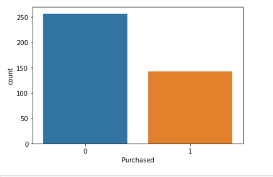
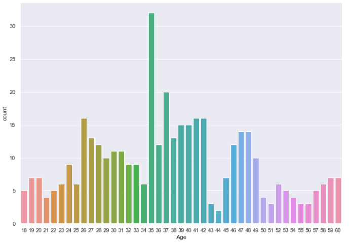
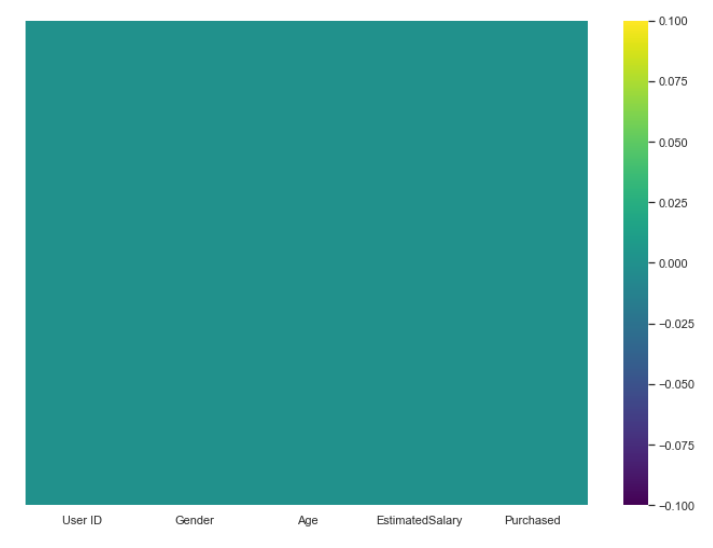

# Logistic-Regression-SUV-Data-Prediction
Logistic regression is a technique in statistical analysis that attempts to predict a data value based on prior observations. A logistic regression algorithm looks at the relationship between a dependent variable and one or more dependent variables.
## Visualizing data before processing

How many people actually purachsed

At what age most people tend to buy SUV

Analysing missing values with help of heat map

## Evaluating model with confusion matrix

from sklearn.metrics import confusion_matrix
confusion_matrix(y_test,predictions)

array([[65,  3],
       [ 8, 24]], dtype=int64)
       
## Accuracy

from sklearn.metrics import accuracy_score

accuracy_score(y_test, predictions)*100

89.0

Accuracy: Overall, how often is the classifier correct?
(TP+TN)/total = (65+24)/100 = 0.89

## Misclassification rate
mis_cla_rate  = (11)/len(y_test)

0.11
